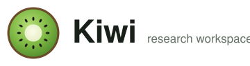
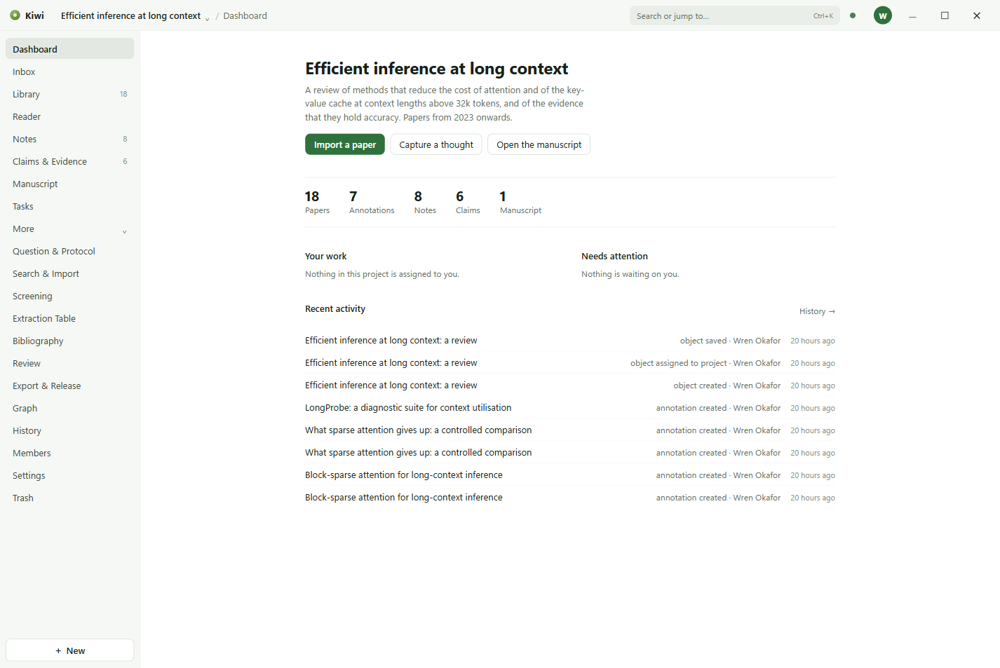
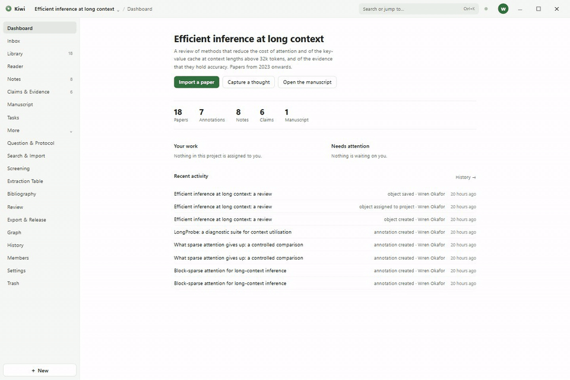
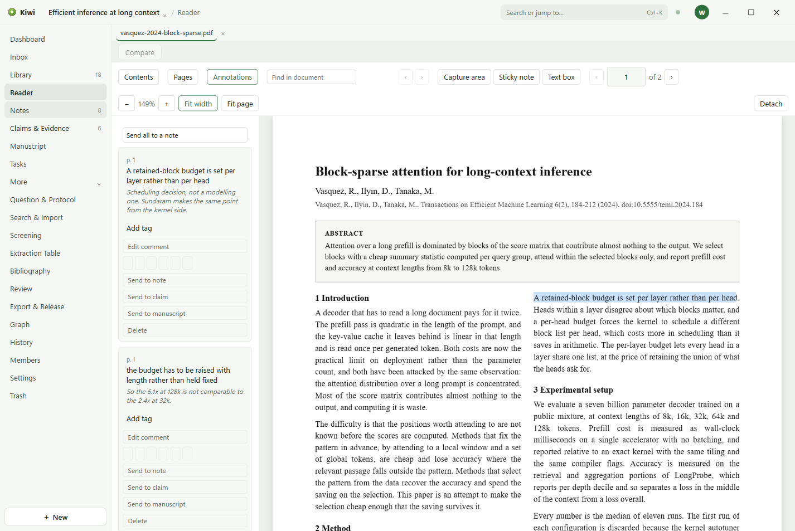
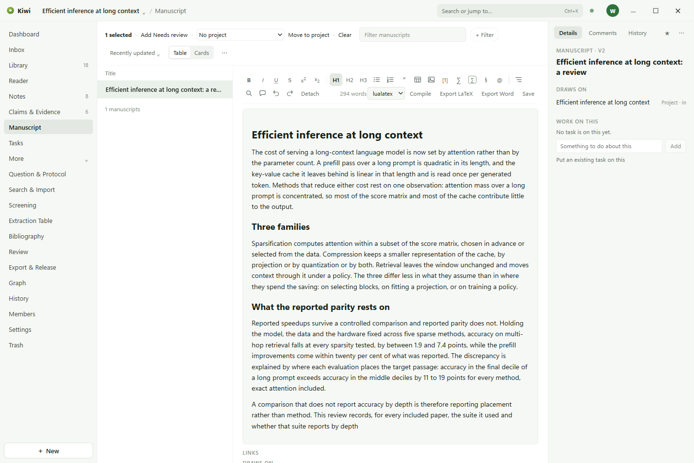
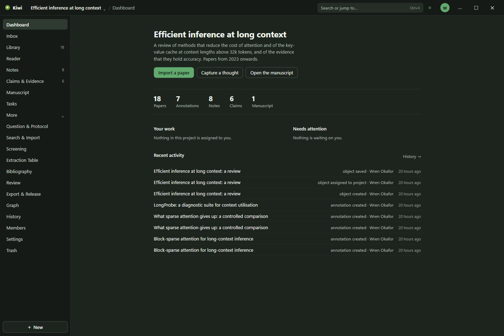

<p align="center">
  <picture>
    <source media="(prefers-color-scheme: dark)" srcset="docs/assets/wordmark-dark.svg">
    
  </picture>
</p>

Kiwi is a research workspace for Windows. Papers, notes, claims, tasks, and the manuscript live
together in one project, as readable files in a folder you choose. It is open source under the
Apache License 2.0, and each person or organisation runs their own copy.



## What it does

- **Library.** Papers with their references, PDFs, tags, and read state. Imports and exports
  BibTeX and RIS.
- **Reader.** PDFs with highlights, underlines, notes, and area marks in six colours. Each mark
  stays attached to the passage it was made on.
- **Notes.** Notes that link to the papers, claims, and passages they draw on.
- **Claims and evidence.** Claims with the evidence that supports or contradicts each one, tied
  to the questions and hypotheses of the project's protocol.
- **Manuscript.** A manuscript with citations inserted from the library, compiled to PDF and
  exported to Word and LaTeX.
- **Tasks.** Tasks with assignees and due dates, on any object in the project.
- **Collaboration.** Shared workspaces with comments, presence, and a record of every change.



## Get Kiwi

There is no hosted Kiwi service and no installer to download from this project. You build the
application and run the account service it signs in to.

**On one machine, for yourself.** With Node.js 22.12 or later, pnpm 11, and Docker Desktop:

```
pnpm setup
pnpm dev
```

This starts PostgreSQL in Docker, the account service, and the application, with mail delivery
replaced by fixtures: the verification code is filled in for you.

**For a team.** Run the account service somewhere the team can reach, then package the
application with that address embedded. The [self-hosting guide](docs/self-hosting.md) lists
every step: addresses, mail, the service, Google sign-in, building the installer, and publishing
updates.

## Documentation

- [User guide](docs/guide/README.md): the application, page by page.
- [Self-hosting](docs/self-hosting.md): running your own Kiwi.
- [Contributing](CONTRIBUTING.md): development setup, the verification gate, and how the code is
  arranged.
- [Privacy](PRIVACY.md), [support](SUPPORT.md), and the [security policy](SECURITY.md).
- [Where Kiwi came from](docs/legacy.md): the first Kiwi and the summer it was built in.

## A look around

| The Reader                                       | Claims and evidence                            |
| ------------------------------------------------ | ---------------------------------------------- |
|  |  |

| The manuscript                                       | Dark theme                                                         |
| ---------------------------------------------------- | ------------------------------------------------------------------ |
|  |  |

## Requirements

| What    | Version                               |
| ------- | ------------------------------------- |
| Windows | 10 or 11, 64-bit                      |
| Node.js | 22.12.0 or later, to build            |
| pnpm    | 11.12.0, to build                     |
| Docker  | Docker Desktop, for the local service |

## Licence

Apache License 2.0. See [LICENSE](LICENSE) and [NOTICE](NOTICE).
