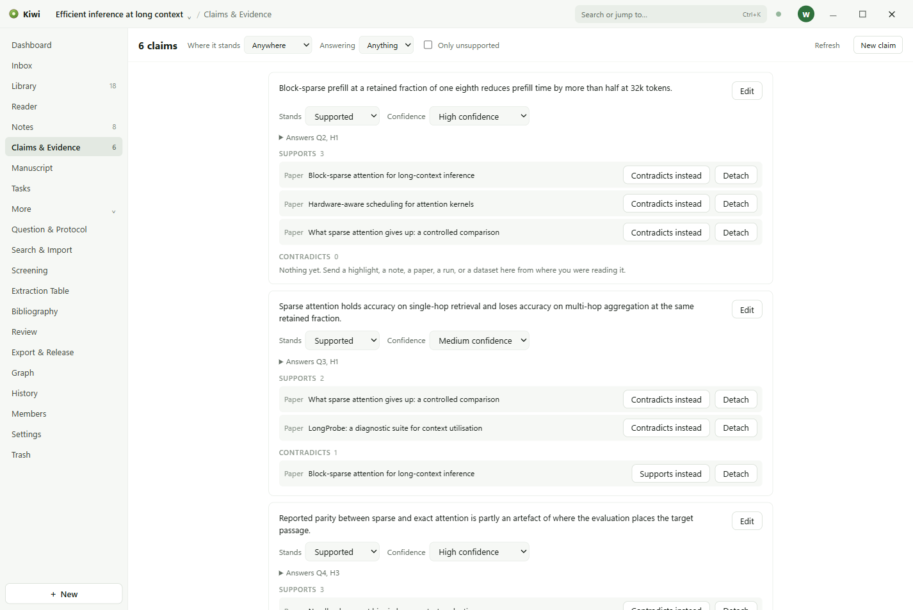

# Claims and evidence

A claim is a sentence you are prepared to write, and the page keeps the evidence for it and
against it next to it, so that what the manuscript says can be traced to what was read.

## Making a claim

**New claim** takes the statement, and:

- **Status.** Draft, supported, contradicted, or abandoned. A claim starts as a draft; as evidence
  arrives, the status says where it stands.
- **Confidence.** Low, medium, or high.
- **Answers.** Which of the protocol's questions or hypotheses the claim speaks to, by their
  labels: Q1, Q2, H1, and so on.

## Evidence

Each piece of evidence is a passage from a paper, marked **Supports** or **Contradicts**. Add it
from the claim, choosing the paper and the highlight, or from the Reader, choosing the claim. The
quotation keeps its mark, so that clicking it opens the Reader on the passage.

A claim's Details list every paper it cites, and each paper's Details list the claims that cite it,
as support or against.

## Into the manuscript

A claim is cited in the manuscript by inserting a citation to the papers behind it. The
bibliography is built from those citations in the project's citation style.
