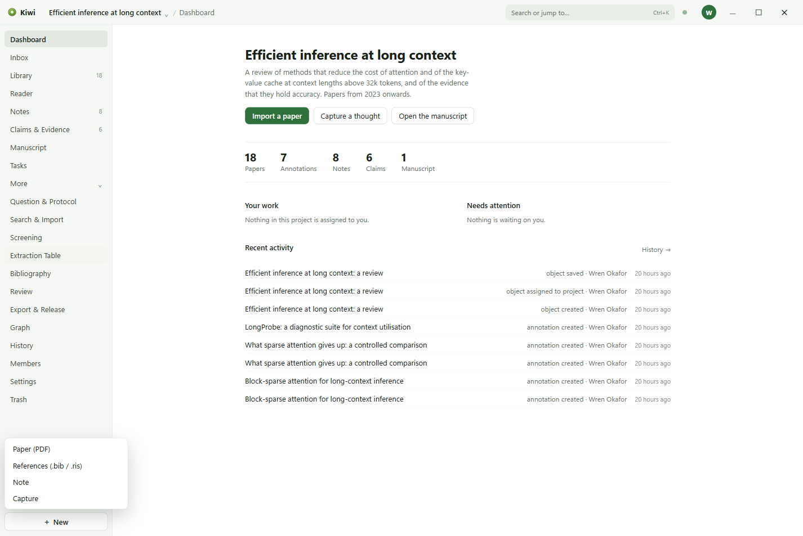
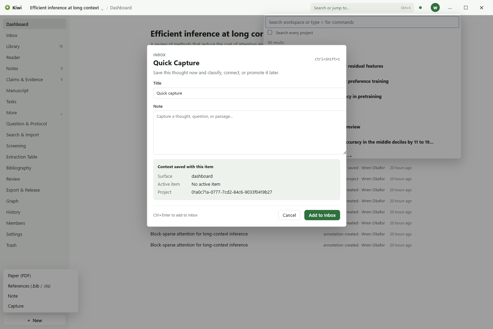
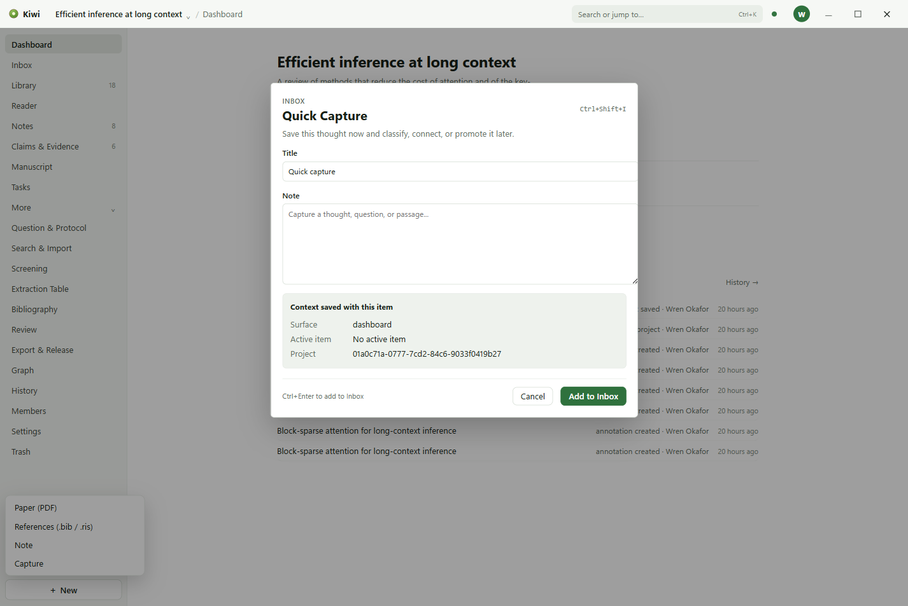

# Getting started

## Signing in

Kiwi opens on a sign-in page. An account identifies you to the account service your copy of Kiwi
was set up with, and is what lets you share a workspace with other people. Create an account with
an email address and a password, or sign in with Google if the service offers it. A verification
code arrives by email; on a development setup it is filled in for you.

Kiwi works without a network connection once you are signed in. The dot beside the search box in
the top bar says whether the service is reachable: green when it is, amber when Kiwi is offline,
and red when something needs your attention. Click it to see what is waiting to be sent.

## A workspace and a project

The first time in, Kiwi asks for a folder. That folder becomes the workspace: everything you make
is written there as ordinary files, and nothing is stored anywhere else unless you share the
workspace.

Then it asks for a project. Give it a name and a description, and choose a type:

| Type              | Turns on                              |
| ----------------- | ------------------------------------- |
| General           | The core pages only                   |
| Literature review | Screening and the Extraction Table    |
| Qualitative       | The Codebook and the Extraction Table |
| Quantitative      | Data, Analysis, and Results           |
| Everything        | Every page                            |

The core pages are always there. The type can be changed later in Settings, and so can the pages
individually.

## The window

Three regions, left to right:

- **The rail** lists the pages. The eight pages you use most are always shown; the rest are
  behind **More**. Objects you pin sit below them, and **New** at the bottom makes a paper from a
  PDF, imports references from a BibTeX or RIS file, starts a note, or captures a thought.
- **The page** takes the middle. Its name is in the top bar, after the project's.
- **The dock** opens on the right when something is selected. **Details** shows the object, what
  it draws on, its tags, and the tasks on it. **Comments** holds the conversation about it.
  **History** lists its versions and can restore one. The star pins the object to the rail.

The top bar carries the project switcher, the page name, the search box, the sync dot, the
avatars of anybody else in the same document, your account menu, and the window controls.

## Finding things

**Ctrl+K** opens the command centre. Type to search the workspace by title and note text, or type
`>` first to run a command. **Search & Import**, behind More, is the same search as a page.

## Capturing a thought

**Ctrl+Shift+I** from anywhere, or **Capture a thought** on the Dashboard, opens Quick Capture.
Whatever you write lands in the **Inbox** with a note of where you were, so that a thought that
arrives while reading is kept without leaving the page. File it from the Inbox later: connect it
to a paper or a note, or turn it into one.

## Themes

Kiwi has a light and a dark look and follows the Windows setting for which one to use.
