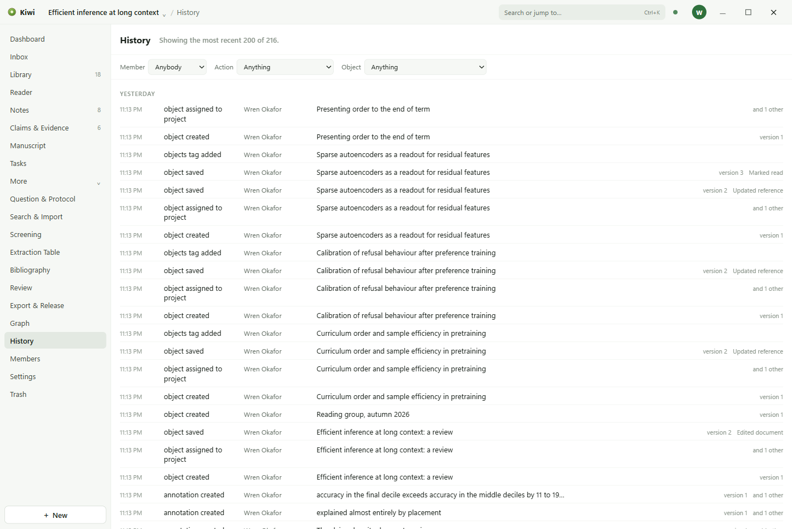

# History and collaboration

Kiwi records every change anybody makes, keeps every version of every object, and shares a
workspace between the people who are invited to it.

## The History page

History, behind More, lists everything that happened in the workspace, newest first and grouped
by day: the time, what was done, who did it, and what it was about. Filter by member, by action,
or by object. Click a row to open the object it was about.

The Dashboard's **Recent activity** is the same log, cut to the project and to its last few rows.

## Versions

Every save of an object is a version. The **History** tool in the dock lists the versions of the
selected object, compares any two, and restores one. A restore asks for a reason, which is kept
with the version it makes.

## Trash

Deleting an object moves it to the Trash, behind More. From there it can be restored, or deleted
for good. **Age cleanup** deletes for good everything that has been in the Trash longer than a
number of days you choose.

## Members

Members, behind More, lists who is in the workspace and what each can do:

| Role      | Can                                                              |
| --------- | ---------------------------------------------------------------- |
| Owner     | Run the workspace. Cannot be removed while they are the only one |
| Admin     | Invite people, change roles, and remove people                   |
| Editor    | Write and edit everything in the workspace                       |
| Commenter | Read everything and comment on it                                |
| Viewer    | Read everything                                                  |

Invitations go by email and expire. **Project exceptions** give somebody less on one project than
they have on the workspace, for a project that is more sensitive than the rest.

## Comments

The **Comments** tool in the dock holds the conversation about the selected object. Mention
somebody with **@** and they are notified. The **Review** page, behind More, lists every comment
thread in the project by what it is about, so that nothing waiting for an answer is missed.

## Keeping in step

Changes to a shared workspace are sent to the account service and arrive in everybody else's
copy. The dot in the top bar says where that stands; click it for what is waiting. Working
offline, everything still opens and can be edited, and what you did is sent when the connection
returns. Two people editing the same thing while apart produces a conflict, which the Dashboard
lists under **Needs attention** and the Inbox lets you compare and resolve.

Notes are the one thing edited live: two people in the same note see each other's cursors and
each other's typing as it happens.
