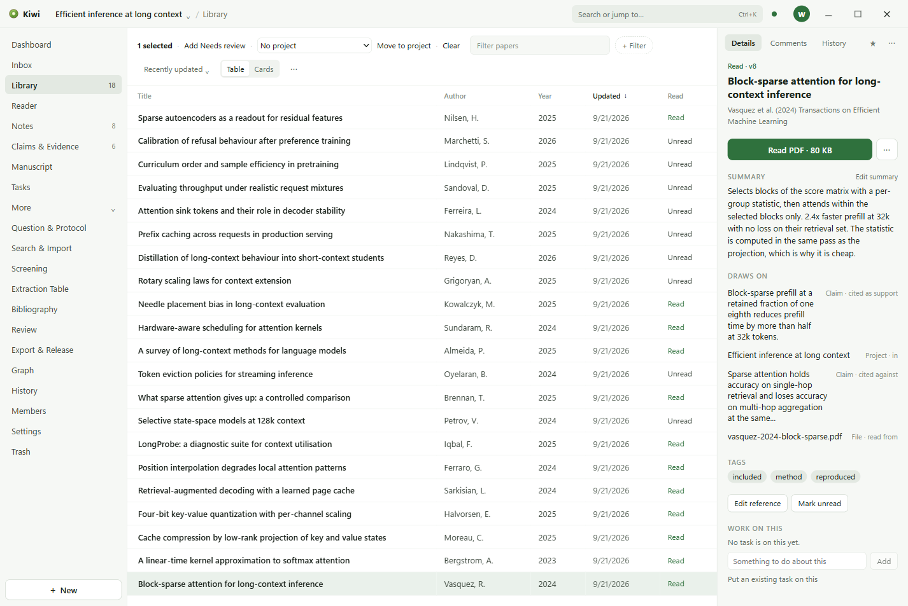

# Library

The Library is every paper in the project, with its reference, its files, its tags, and whether
you have read it.

## Adding papers

**New** in the rail, or **Import a paper** on the Dashboard, offers three ways in:

- **Paper (PDF).** Choose a PDF, or drop one onto the window. Kiwi reads what it can of the
  reference from the file and makes a paper with the PDF attached.
- **References (.bib / .ris).** Import a BibTeX or RIS file. Each entry becomes a paper. Attach a
  PDF to any of them afterwards from its Details.
- **Search & Import**, behind More, searches what is already in the workspace.

A paper's reference can be edited at any time with **Edit reference** in its Details.

## The list

The control row above the list holds the filter box, the active filters as chips, **+ Filter**,
the sort order, and a switch between the table and cards. Filters are by type, tag, author, year,
and read state. The **...** menu chooses the columns and opens a review of possible duplicates
across the Library.

Select rows with their checkboxes. With a selection, the row offers to add the **Needs review**
tag to all of them, to move them to another project, or to clear the selection.

## A paper's Details

Selecting a paper opens it in the dock:

- **Read PDF** opens its file in the Reader. A paper with several files lists them.
- **Summary** is a short note of what the paper says, kept with the reference.
- **Draws on** lists what the paper is connected to: the claims that cite it, the notes that
  quote it, and the project it is filed in.
- **Tags** are shown as chips. A tag is added from the row's menu or from the bulk row.
- **Mark unread** and **Mark read** keep the read state, which is also a column and a filter.
- **Work on this** lists the tasks on the paper and takes a new one.

## Files

A paper's PDF and any other file it carries are kept in the workspace folder, next to the paper.
A file dropped onto the window that is not a paper is kept the same way, and the Library lists it
among the files.
