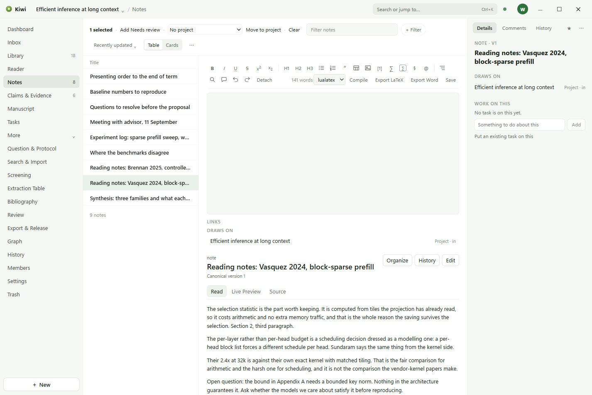

# Notes

A note is a page of writing that belongs to the project: reading notes on a paper, minutes of a
meeting, an experiment log, a running list of questions.

## Writing

**New** in the rail, or **New Note** on the Notes page, starts a note. The editor is the same one
the manuscript uses: headings, lists, quotations, tables, images, mathematics, and footnotes, with
a toolbar of marks above the page. Everything saves itself; **Ctrl+S** saves at once.

Type **@** to link to a paper, a note, a claim, or a task by name. The link is kept as a
connection, and appears under **Draws on** in the Details of both objects.

## Quotations

A quotation from the Reader is pasted into a note as a block that carries the mark it came from.
Click it to open the Reader on that passage. A note that quotes a paper draws on it, and the
paper's Details list the note.

## Writing together

In a shared workspace, a note open in two windows is edited live. Each person's cursor is shown
in the other's editor, with their initials, and the avatars in the top bar show who is in the
same note.

## The Inbox

Thoughts captured with **Ctrl+Shift+I** land in the Inbox rather than among the notes. Each
captured thought remembers where you were when you had it. From the Inbox, connect it to a paper
or a note, turn it into a note of its own, or delete it.

## Files on a note

A note can carry files: a data table, a figure, a spreadsheet. Drop a file onto the note, or
attach one from its Details. The file is kept in the workspace folder next to the note.
