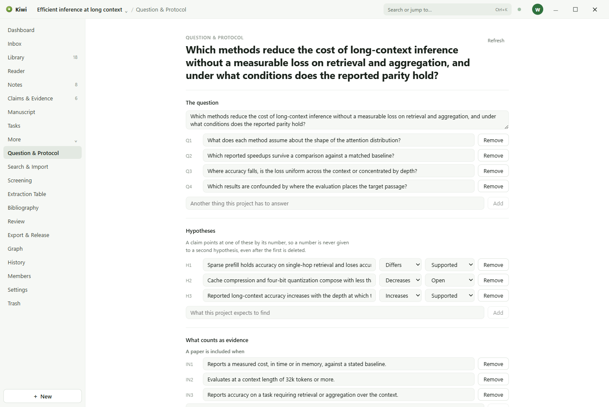
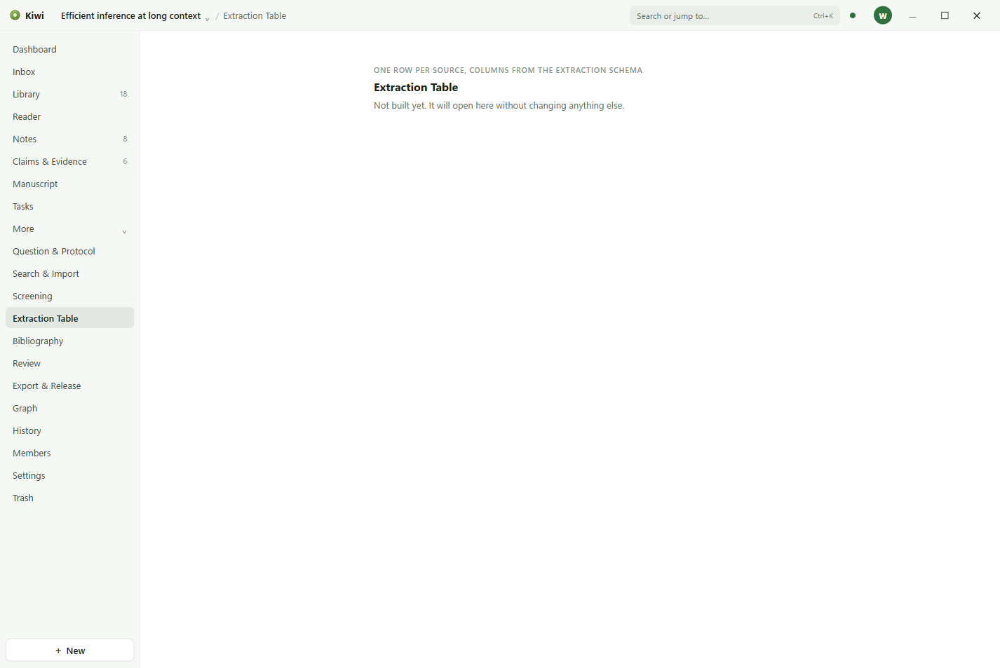

# Question and protocol

The protocol is what the project set out to do, written down before the reading so that the
reading can be held to it.

## What it holds

- **The research question**, and the sub-questions under it, labelled Q1, Q2, and so on.
- **Hypotheses**, labelled H1, H2, and so on, each with the direction it predicts: an increase, a
  decrease, a difference, or none.
- **Inclusion and exclusion criteria**, for deciding which sources belong in the review.
- **The extraction schema**: the fields to record for every included source. A field is text, a
  number, a yes or no, a date, or a choice from a list.
- **Methods**: the search strings, the databases, and how the work was done, as a paragraph.

Claims answer the questions and hypotheses by their labels, so that the Claims page can be read
as the protocol's answers.

## Changing it

A protocol can be edited at any time. **Log a deviation** records a departure from it with a
reason, so that the change is part of the project's record rather than a silent edit.

## Screening and extraction

For a literature review, the protocol's criteria and schema are what the Screening and Extraction
Table pages are for. In this version those pages are placeholders: they open and say so. Record
screening decisions with tags on the papers, and extraction in a note per paper, until they arrive.

