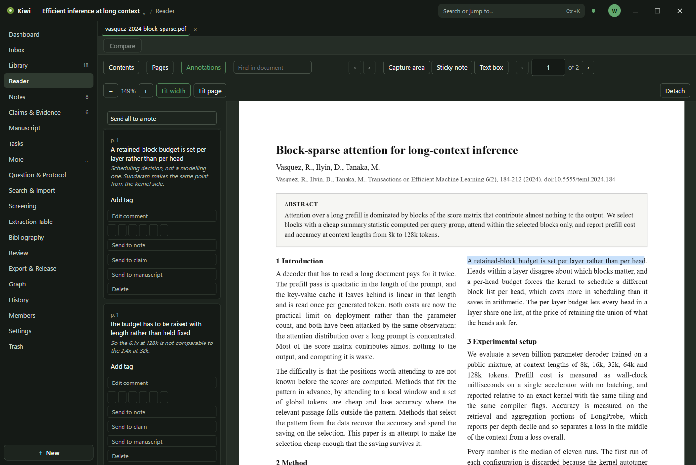

# Reader

The Reader is where a PDF is read and marked up. Every document you open stays as a tab, and the
marks you make stay attached to the passage they were made on.

## Opening a document

Select a paper in the Library and choose **Read PDF** in its Details. The Reader opens on that
file. Several documents can be open at once; their tabs sit above the page. **Ctrl+Tab** moves to
the next tab and **Ctrl+W** closes the current one. **Compare** puts two open documents side by
side.

**Detach** puts the document in a window of its own, for a second screen.

## Reading

The toolbar has **Contents**, which lists the document's sections when the file has them,
**Pages**, which shows every page as a thumbnail, and **Annotations**, which lists the marks.
**Find in document** searches the text; the arrows step through the matches. The page box takes
the number printed on the page, and the zoom controls sit beside **Fit width** and **Fit page**.

## Marking up

- Drag over text to **highlight** it.
- **Sticky note** writes a note onto the page where you click.
- **Text box** writes words onto the page itself.
- **Capture area** cuts a rectangle out of the page, for a figure or a table, and keeps it as an
  image.

Every mark has a colour: yellow, green, blue, purple, red, or orange, chosen from the swatches
under the mark. A mark can carry a comment and tags, and the words under a highlight are kept with
it, so that a quotation can be followed back to the page it came from.

The **Annotations** panel lists every mark in the document in reading order, with who made it. In
a shared workspace, each person's marks are theirs.

## From a mark to the rest of the project

A highlight is the raw material for a note or a claim. Under each mark in the Annotations panel:

- **Send to note** quotes it into a note.
- **Send to claim** adds it as evidence for or against a claim.
- **Send to manuscript** quotes it into the manuscript.
- **Send all to a note**, at the top of the panel, collects every mark in the document into one
  note.

The quotation carries the mark with it: click it in the note, the claim, or the manuscript and
the Reader opens on the passage.

