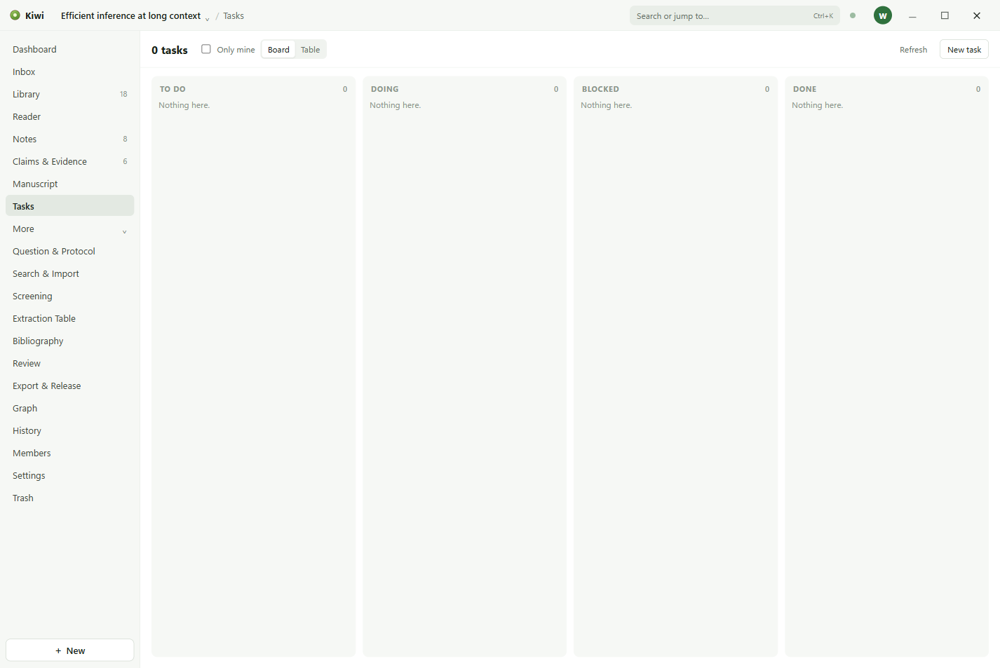

# Tasks

A task is a thing to do, on a thing in the project.

## Making a task

**New task** on the Tasks page takes a title, an assignee from the workspace's members, a due
date, and a status: to do, doing, blocked, or done. A task can also be started from any object's
Details, under **Work on this**, and is then about that object.

## Where tasks show up

- **Tasks** lists every task in the project, with a filter by status and assignee and a choice of
  view.
- **Your work** on the Dashboard lists the open tasks assigned to you, soonest first, with overdue
  ones marked. Ticking one completes it.
- An object's Details list the tasks on it.

Tasks belong to people, so the page opens once Kiwi knows who you are.
